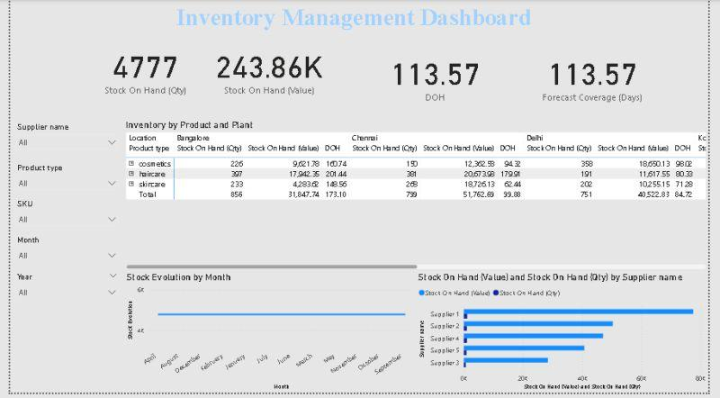

# 📦 Inventory Management Dashboard – Power BI

🚀 A complete **Power BI Dashboard** built to analyze **Inventory Management** with both operational and financial insights.  

---
## 📅 Project Duration
**SEP 2025 – SEP 2025**
---

## 🔍 Key Insights
- 📦 Stock on Hand (**Quantity & Value**)  
- 📊 Days of Inventory on Hand (DOH)  
- 📈 Forecast Coverage  
- 🎯 Target Stock Comparison  
- ⏳ Stock Evolution over Time  

---

## 🛠️ Data Modeling
Designed with a **Star Schema**:
- **FactInventory**  
- **DimProduct**  
- **DimPlant**  
- **DimCalendar**  

---

## 📸 Dashboard Preview
  
---

## 🧑‍💻 Skills Applied
- Power Query Transformations  
- DAX Measures  
- Data Modeling (Star Schema)  
- Supply Chain Analytics  
- Dashboard Design in Power BI  

---

## 📂 Files
- `Inventory_Management.pbix` → Full Power BI file (optional)  
- `screenshots/` → Dashboard preview images  

---

## 🔗 Connect
If you’d like a personalized version or the PBIX file, feel free to connect with me:  
👉 [LinkedIn – Muhammad Affaf](https://www.linkedin.com/in/muhammadaffaf/)  

---

### Tags
`#PowerBI` `#InventoryManagement` `#SupplyChainAnalytics` `#DataModeling` `#DashboardDesign`
